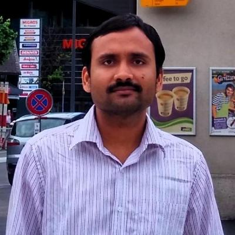

---
# Feel free to add content and custom Front Matter to this file.
# To modify the layout, see https://jekyllrb.com/docs/themes/#overriding-theme-defaults

layout: default
---

    
    <!--  -->
    <h1>Ram Krishna Sharma</h1> 
    
Hi! I am Ram Krishna Sharma. I am a PhD student from <a href="http://www.du.ac.in">University of Delhi</a>, Delhi, India. I just submitted my PhD thesis, titled <strong><em>Search For Anomalous Gauge Coupling through Vector Boson Scattering and Development of the GEM Detectors at the CMS Experiment</em></strong>, in November 2018. Currently, I am looking for a Post-Doc position.

    

        During PhD, I worked on both aspects of experimental particle physics, i.e., physics analysis and detector related work. For physics analysis, I worked on the measurement of anomalous quartic gauge coupling using the opposite sign WW that decays semi-leptonically. As this analysis was challenging to do at the currently available luminosity (of 2016), but we took the challenge of perform this analysis and finally by mid-2018, we showed to the CMS collaboration that this analysis can be performed and gave the wold's best limits. Hurray!!!
    

    

        For detectors, I work on the GEM detector R&D. For the CMS-GEM collaboration, I was mainly involved in the beam test from starting of the detector setup to the data analysis of beam test. Furthermore, I am part of developing the GEM detector lab at my university and chaterised the indian made GEM foil in Univerisity of Delhi, which results in our seperate paper from University of Delhi GEM group.     
    

    

        Currently, I continued working on the physics analysis with full run-2 data. As well as on detector side, I am working on the development on XDAQ for GE1/1 detector (Presently, I am in learning phase).
    

    

        Along with that I enjoy coding and scripting. I used C/C++, Python, shell script, and html. And in free time, I try to summarize my knowledge in this website.
    

    

<!-- /.blurb -->